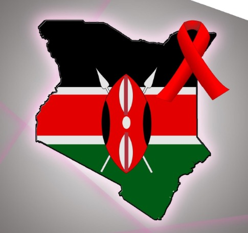
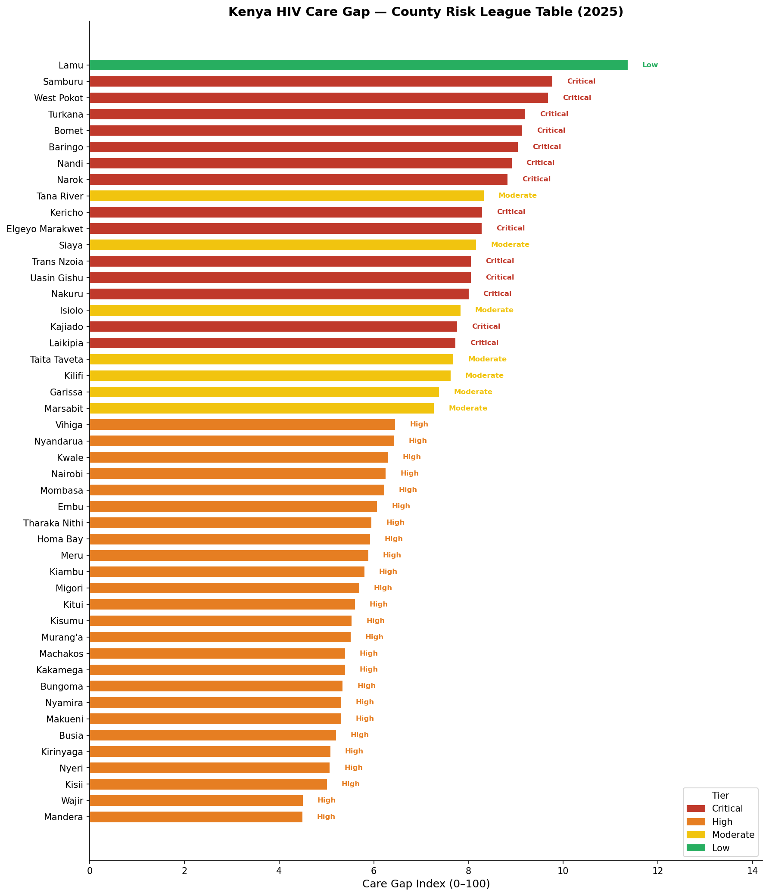
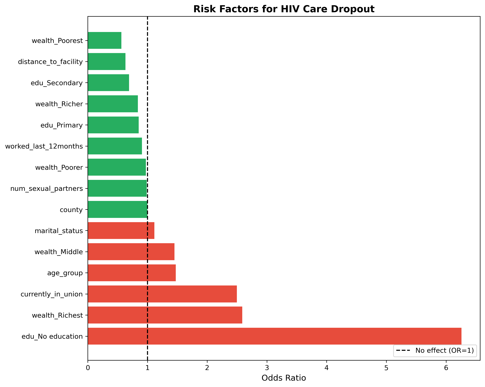

<div align="center">
  

  # HIV Care Gap AI · Kenya
  ### County Risk Mapping · Individual Dropout Risk Factors · 2030 Scenario Forecasting

  **Using Machine Learning to Identify Who Kenya is Leaving Behind**

  [](https://hivcaregapai.streamlit.app/)
  [](https://public.tableau.com/app/profile/naomi.opiyo/viz/HIVCareGapAIKenya2025/HIVCareGapAI?publish=yes)
  [](https://python.org)
  [](https://en.wikipedia.org/wiki/Cross-industry_standard_process_for_data_mining)

  **Team:** Daniella Muli · Eve Michelle · Naomi Opiyo · Pheonverah Achieng' · Lorenah Mbogo · Dennis Kamuri
</div>

---

## The Problem

Kenya's HIV response reversed course in 2024. New infections rose **19% in a single year** — from 16,752 to **19,991** — breaking a decade of hard-won progress. Just **10 counties account for 60% of all new infections**. Treatment Interruption (IIT), defined as missing an ART visit by 28 or more days, is the primary driver of viral rebound and onward transmission.

Yet the Ministry of Health had no tool to answer three fundamental questions at county level:

| Question | Why it matters |
|----------|----------------|
| **WHERE** is the health system losing patients, by county? | Resource allocation requires knowing which counties are worst — not just nationally |
| **WHO** is most likely to disengage from care, by profile? | Community health worker outreach must be targeted to be effective |
| **WHAT HAPPENS** by 2030 if we act — or if we don't? | Donors and policymakers need quantified projections to justify investment |

**HIV Care Gap AI** builds that tool — three integrated models giving the MOH precision intelligence to close the gap.

---

## The Three-Model Architecture

| Model | Question | Algorithm | Primary Output |
|-------|----------|-----------|----------------|
| **Model 1 — County Care Gap Map** | *Where* to intervene? | Care Gap Index (CGI) + KMeans clustering (k=4) | 47 counties tiered 🔴 Critical / 🟠 High / 🟡 Moderate / 🟢 Low |
| **Model 2 — Dropout Risk Factors** | *Who* to prioritise? | Logistic Regression + 500-sample bootstrap | Odds ratios with 95% CI for 17 demographic features |
| **Model 3 — 2030 Scenario Projection** | *What happens next?* | Tier-based scenario projection (BAU vs Bridged Gap) | Dual-scenario IIT/VLS trajectories + 233,186+ patients retained |

> **Important algorithm note:** Two decisions changed from the original proposal during execution — both for better, more defensible results. Prophet → Scenario-based projection (only 2025 data available; Prophet requires 3–4 years). XGBoost → Logistic Regression with odds ratios (DHS 2022 dropout rate was 0.08% — 26 positive cases out of 32,156 records; XGBoost predicted all-zeros at this imbalance). Odds ratios are the standard epidemiological language used in NASCOP and PEPFAR Kenya reports. Both changes are documented in `constants.py` and the relevant notebooks.

---

## Stakeholders

| Stakeholder | How They Use This |
|-------------|------------------|
| **MOH Kenya** (national) | County tier rankings for strategic resource allocation |
| **County Directors of Health** | Subnational intervention prioritisation |
| **NSDCC / NASCOP** | Programme performance monitoring and scenario planning |
| **Community Health Workers** | Know which patient profiles to prioritise for follow-up |
| **PEPFAR / UNAIDS / World Bank** | Quantified 2030 projections to justify investment decisions |

---

## Data Sources

### Dataset 1 — NSDCC Raw Programme Data (Models 1 & 3)

Source: [analytics.nsdcc.go.ke](https://analytics.nsdcc.go.ke) → HIV Estimates 2025

> **Download all raw files:** [Google Drive](https://drive.google.com/drive/folders/1vJ6NUUUjVKgZPfy37ODNRvDQW81kTDQK?usp=sharing)
> After downloading, place all files in `data/raw/`

| File | Rows | Columns | Period | Notes |
|------|------|---------|--------|-------|
| `Adult_on_ART.xlsx` | 47 | 11 | `"December 2025"` (string) | County suffix `" County"` must be stripped |
| `Adult_on_HTS.xlsx` | 47 | 7 | 2025 (integer) | — |
| `HTS_Positive.xlsx` | 47 | 15 | 2025 | 14 missing values imputed |
| `VLT.xlsx` | 47 | 7 | None | Single-period snapshot only |
| `IIT.xlsx` | **9** | 13 | None | **Region-level only** — expanded to 47 counties via `expand_iit_regions()` |

> ⚠️ **IIT limitation (documented):** The IIT file contains data for 9 MOH administrative regions, not 47 counties. Counties within the same region share the same IIT rate, understating within-region variation. This is a source data limitation, not a project error.

### Dataset 2 — DHS Kenya 2022 Individual Recode (Model 2)

Source: [dhsprogram.com](https://dhsprogram.com) — approved and downloaded.

| Property | Value |
|----------|-------|
| Source file | `KEIR8CDT.ZIP` (Stata format) |
| Original columns | 5,925 |
| Reduced to | 15 features (column-renamed from DHS codes) |
| Final clean records | 32,156 |
| Dropout cases | **26 (0.08%)** — extreme class imbalance |
| Columns dropped | `knows_aids_death`, `has_health_insurance` (100% missing — DHS 2022 sampling design) |

---

## Data Pipeline (CRISP-DM Order)

```
Raw data (data/raw/)
  └─ NB01: Data Extraction      → validate all county/region maps against file values
  └─ NB02: NSDCC Cleaning       → 47 counties, imputation, IIT expansion (9 regions → 47 counties)
  └─ NB03: DHS Cleaning         → decode, impute, engineer dropout target, one-hot encode
  └─ NB04: Feature Engineering  → Care Gap Index (CGI), county_profiles.csv
  └─ NB05: Model 1 (KMeans)     → 4 tiers assigned, silhouette = 0.6359
  └─ NB06: Model 2 (LogReg)     → odds ratios + 95% CI via 500-sample bootstrap
  └─ NB07: Model 3 (Projection) → dual scenario forecasts to 2030
  └─ NB08: Evaluation           → all metrics consolidated, model_evaluation_summary.json
  └─ NB09: Deployment           → Streamlit Cloud live, trigger scripts
  └─ NB10: Final Report         → business understanding, cross-model integration, MOH recommendations
```

### Care Gap Index (CGI) — Model 1 Core Formula

$$\text{CGI} = \bigl(0.40 \times \text{IIT rate}\bigr) + \bigl(0.40 \times (1 - \text{VLS rate})\bigr) + \bigl(0.20 \times \text{HTS positivity rate}\bigr) \times 100$$

- IIT rate carries **40%** weight — most direct signal of care cascade failure
- Inverse VLS rate carries **40%** weight — ultimate clinical outcome
- HTS positivity rate carries **20%** weight — burden signal

### Why k=4 and not k=3?

Silhouette score for k=3 is 0.6582 (marginally higher than k=4 at **0.6359**). However, the intervention framework requires four distinct priority levels — Critical and High tiers each receive different intervention intensities in Model 3. Using k=3 would collapse two intervention levels and lose policy-relevant granularity. This decision is documented in `constants.py` and notebook 05.

### Dropout Target Variable (Model 2)

A person is flagged as a potential dropout if:
- `told_hiv_positive == 1` — has been informed of HIV-positive status, **AND**
- `tested_hiv_last_12months == 0` — has not engaged with testing services in the past 12 months

> `tested_hiv_last_12months` is excluded from model features to prevent data leakage (it is part of the target definition).

---

## Key Metrics Defined

| Metric | Definition |
|--------|-----------|
| **IIT Rate** | % of ART patients who interrupt treatment (miss a visit by 28+ days) |
| **VLS Rate** | % of patients on ART with viral load below the suppression threshold |
| **HTS Positivity Rate** | % of individuals tested who receive a positive HIV result |
| **ART Coverage** | % of PLHIV currently receiving ART |
| **Care Gap Index (CGI)** | Composite score (IIT × 40% + inverse VLS × 40% + HTS positivity × 20%) — higher = worse |

---

## Model Results

### Model 1 — County Care Gap Map

**Silhouette Score (k=4): 0.6359**

| Tier | Counties | Mean IIT% | Mean VLS% | Intervention |
|------|----------|-----------|-----------|--------------|
| 🔴 Critical | 14 | 15.30% | — | ← PRIMARY TARGET |
| 🟠 High | 25 | 9.49% | — | ← PRIMARY TARGET |
| 🟡 Moderate | 7 | — | — | Monitor |
| 🟢 Low | 1 | — | — | Sustain |

All 14 Critical tier counties are concentrated in the **Rift Valley region**. Together, Critical and High tiers account for **39 of 47 counties** — Kenya's HIV care gap is widespread, not isolated.

> **Lamu anomaly:** Lamu ranks #1 on CGI (11.37) despite a low IIT rate (9.26%). Its VLS rate is the **lowest in Kenya at 81.36%** — patients are staying on ART but not suppressing virally. This is a medication adherence or drug supply issue, not a retention failure. Standard retention interventions will not fix Lamu. It is addressed separately in Recommendation 4.



### Model 2 — Dropout Risk Factor Analysis

> **Language note:** With only 26 dropout cases out of 32,156 records (0.08%), individual dropout *prediction* is not reliable. What *is* valid: **odds ratios from logistic regression**. These are the standard epidemiological measure used in NASCOP and PEPFAR Kenya reports and the correct tool for this class imbalance.

**Model performance:**

| Metric | Value |
|--------|-------|
| AUC-ROC | 0.7243 (primary metric — better than chance) |
| Recall | 0.40 (40% of actual dropouts caught in test set) |
| Bootstrap | 500-sample for 95% CIs on all odds ratios |

**Top risk factors:**

| Risk Factor | OR | Interpretation |
|-------------|-----|----------------|
| No formal education | 6.26× | Strongest demographic driver |
| Wealth: Richest quintile | 2.60× | May seek private care outside monitoring |
| Currently in a union | 2.50× | |
| Older age groups | 1.49× | |

**Protective factors:** Wealth_Poorest (OR = 0.49), Secondary education (OR = 0.65), Primary education (OR = 0.86) — individuals who depend on public health infrastructure are more likely to remain in the system.

> `ever_tested_hiv` shows OR ≈ 35 with CI (0.04–6,501). This is a **structural artefact**: by definition, only people who have ever tested HIV-positive can appear in the dropout group. The dashboard caps display at OR = 8.0 so this artefact does not destroy the axis scale.



### Model 3 — 2030 Scenario Projection

- **Scenario A (BAU):** Current IIT and VLS rates remain constant through 2030
- **Scenario B (Bridged Gap):** 30% IIT reduction applied to Critical and High tier counties from 2026; ΔVLS = −0.5 × ΔIIT (PEPFAR evidence-based formula)

| Outcome | Value |
|---------|-------|
| Additional patients retained by 2030 | **233,186+** |
| Critical tier IIT rate (Scenario B) | 15.30% → 10.71% |
| High tier IIT rate (Scenario B) | 9.49% → 6.64% |
| Moderate / Low tiers | Unchanged — intervention concentrated where return is highest |

Every assumption is a named constant in `constants.py` — auditable and adjustable by MOH policymakers.


---

## Four Data-Driven Recommendations for MOH Kenya

**Recommendation 1 (Model 1 — County Care Gap Map)**
Immediately prioritise retention in the 14 Critical tier counties (all Rift Valley region, IIT rate = 15.30%). Deploy CHW follow-up targeting patients who have missed ART visits — prioritise counties with IIT above national average **and** VLS below 90% simultaneously.

**Recommendation 2 (Model 2 — Dropout Risk Factor Analysis)**
Deploy differentiated follow-up protocols for the demographic profiles most strongly associated with dropout risk: no formal education (OR = 6.26×), individuals in a union (OR = 2.50×), and older age groups (OR = 1.49×). These are population-level signals for targeting outreach — not individual clinical scores.

**Recommendation 3 (Model 3 — 2030 Scenario Projection)**
Applying a 30% IIT reduction in Critical and High tier counties from 2026 is projected to retain **233,186+ additional patients** on ART by 2030 — providing a quantified evidence base for PEPFAR, UNAIDS, and World Bank investment decisions.

**Recommendation 4 (Lamu — Special Case)**
Investigate Lamu County separately as a **viral suppression failure, not a retention failure**. Lamu has the lowest VLS rate in Kenya (81.36%) while patients are staying on ART. This suggests drug resistance, stock-out, or sub-therapeutic dosing — requiring a different clinical response from the standard retention playbook.

---

## Project Structure

```
hiv-care-gap-ai/
│
├── data/
│   ├── raw/                         # NSDCC Excel files + DHS CSV (download separately)
│   │   ├── Adult_on_ART.xlsx
│   │   ├── Adult_on_HTS.xlsx
│   │   ├── HTS_Positive.xlsx
│   │   ├── IIT.xlsx
│   │   ├── VLT.xlsx
│   │   └── individual_features.csv
│   │
│   └── processed/                   # Generated by main.py — do not edit manually
│       ├── nsdcc_clean.csv          # 47 counties × 51 features
│       ├── county_profiles.csv      # 47 counties × 57 features + tier assignments
│       ├── individual_features_clean.csv  # 32,156 × 24 (dropout rate 0.08%)
│       ├── dropout_risk_factors.csv
│       ├── tier_timeseries.csv
│       ├── tier_change_log.json     # Year-on-year tier movement tracker
│       ├── forecast_national.csv
│       ├── forecast_critical.csv
│       ├── forecast_high.csv
│       ├── forecast_moderate.csv
│       ├── forecast_low.csv
│       └── patients_retained.csv
│
├── notebooks/                       # Run in order — each builds on the previous
│   ├── 01_data_extraction.ipynb    # Validate county/region maps
│   ├── 02_nsdcc_cleaning.ipynb     # 47 counties, imputation, IIT expansion
│   ├── 03_dhs_cleaning.ipynb       # Decode, impute, engineer dropout target
│   ├── 04_feature_engineering.ipynb # Care Gap Index, county_profiles.csv
│   ├── 05_model_1_county_clustering.ipynb   # KMeans k=4, silhouette=0.6359
│   ├── 06_model_2_dropout_prediction.ipynb  # LogReg + 500-sample bootstrap
│   ├── 07_model_3_projection.ipynb # Dual scenario forecasts to 2030
│   ├── 08_model_evaluation.ipynb   # Consolidated metrics
│   ├── 09_deployment.ipynb         # Streamlit Cloud deployment
│   ├── 10_monitoring.ipynb
│   └── final_notebook.ipynb        # Final evaluation + business report (NB10)
│
├── src/
│   ├── nsdcc_cleaner.py            # expand_iit_regions() + county normalisation
│   ├── dhs_cleaner.py
│   ├── feature_engineering.py      # CGI formula
│   ├── model_training.py
│   ├── evaluation.py
│   └── projection.py
│
├── app/
│   ├── streamlit_app.py            # 3-tab interactive dashboard
│   ├── trigger_alerts.py
│   └── trigger_predictions.py      # Annual retraining entry point
│
├── models/
│   ├── kmeans_county_tiers.pkl     # Model 1 — KMeans bundle
│   └── xgboost_dropout.pkl         # Model 2 — Logistic Regression bundle
│
├── figures/                         # Charts committed for Streamlit Cloud
├── constants.py                     # All assumptions named here (Model 3 parameters, CGI weights)
├── main.py                          # Full pipeline entry point
└── requirements.txt
```

---

## Quick Start

### Prerequisites

- Python 3.8+
- Conda or virtualenv
- 4 GB RAM minimum

### Setup

**Step 1 — Clone the repository**

```bash
git clone https://github.com/Daniellamuli/Phase-5-HIV-Care-Gap-AI.git
cd Phase-5-HIV-Care-Gap-AI
```

**Step 2 — Create and activate a virtual environment**

Windows (Anaconda):
```bash
conda create -n learn-env python=3.11
conda activate learn-env
```

macOS / Linux:
```bash
python -m venv venv
source venv/bin/activate
```

**Step 3 — Install dependencies**

```bash
pip install -r requirements.txt
```

**Step 4 — Download raw data**

Download all NSDCC Excel files from [Google Drive](https://drive.google.com/drive/folders/1vJ6NUUUjVKgZPfy37ODNRvDQW81kTDQK?usp=sharing) and place them in `data/raw/`.

**Step 5 — Run the full pipeline**

```bash
python main.py
```

This processes all raw data, trains all three models, and writes all outputs to `data/processed/` and `models/`.

**Step 6 — Launch the dashboard**

```bash
streamlit run app/streamlit_app.py
```

---

## Running Notebooks Manually (CRISP-DM Order)

Run notebooks 01–10 sequentially. Each notebook builds on the previous:

```bash
jupyter notebook notebooks/01_data_extraction.ipynb
# Continue through 02, 03, 04, 05, 06, 07, 08, 09 in order
# Notebook 10 (final_notebook.ipynb) loads saved artifacts only — no retraining
```

| Notebooks | Purpose |
|-----------|---------|
| **01–04** | Data extraction, cleaning, and feature engineering |
| **05–07** | Model development (KMeans, LogReg, Projection) |
| **08** | Evaluation — all metrics consolidated |
| **09** | Deployment — Streamlit Cloud |
| **10** | Final evaluation + business report (loads artifacts, no retraining) |

---

## Annual Retraining (Sustainability)

This is not a one-time analysis. When NSDCC publishes 2026 data, a single command reruns the entire pipeline:

```bash
python app/trigger_predictions.py --new-data-year 2026
```

This automatically re-cleans all NSDCC files, re-runs feature engineering, retrains all three models, and logs which counties changed tier year-on-year in `data/processed/tier_change_log.json`:

```
📈 IMPROVED → moved from Critical → High (IIT falling)
📉 WORSENED → moved from High → Critical (IIT rising)
```

When 2026 data is available, the planned next steps are:

1. Validate Model 3 Scenario A projection against 2026 actuals
2. Update Model 3 baseline with 2-year trend data
3. Reassess CGI weights using multi-year empirical data
4. Explore Cox Proportional Hazards model for Model 2 (time-to-dropout)

---

## Dashboard

| Tab | Title | What It Shows |
|-----|-------|---------------|
| **Tab 1** | County Gap Map | Ranked league table + Folium choropleth (47 counties) + county data table + CSV export |
| **Tab 2** | Risk Factors | Forest plot of odds ratios with 95% CI + top risk/protective factors + AUC-ROC |
| **Tab 3** | Scenario Forecast | Scenario A vs B line charts per tier + patients retained counter + CSV export |

---

## Dependencies

| Package | Version | Purpose |
|---------|---------|---------|
| `pandas` | ≥ 1.5.0 | Data manipulation |
| `numpy` | ≥ 1.23.0 | Numerical computing |
| `scikit-learn` | ≥ 1.2.0 | KMeans, Logistic Regression |
| `matplotlib` | ≥ 3.6.0 | Charts and figures |
| `seaborn` | ≥ 0.12.0 | Statistical plots |
| `streamlit` | ≥ 1.28.0 | Interactive dashboard |
| `geopandas` | ≥ 0.12.0 | County boundary maps |
| `folium` | ≥ 0.14.0 | Choropleth map rendering |
| `streamlit-folium` | ≥ 0.11.0 | Folium inside Streamlit |
| `openpyxl` | ≥ 3.0.0 | Read Excel (.xlsx) files |
| `joblib` | ≥ 1.2.0 | Model serialisation (.pkl) |
| `scipy` | ≥ 1.7.0 | Bootstrap confidence intervals |
| `jupyter` | ≥ 1.0.0 | Notebook execution |

---

## Known Limitations

### Data limitations

| Limitation | Impact | What We Did |
|-----------|--------|-------------|
| Only 2025 NSDCC data available | No time-series trend; YoY change is zero | Scenario projection used instead of Prophet; extensible to future years |
| IIT data is regional (9 regions), not county-level | All counties in a region share the same IIT rate | Expanded via `expand_iit_regions()`; documented as approximation |
| VLT is a single snapshot (no Period column) | Cannot track VLS trends over time | Joined on county only; treated as 2025 snapshot |
| DHS 2022 dropout rate = 0.08% (26 cases) | Individual prediction unreliable; wide CIs | Logistic Regression + odds ratios; CIs always reported |
| `knows_aids_death` and `has_health_insurance` 100% missing | Two features dropped | DHS 2022 sampling design — not a project error |

### Model limitations

| Limitation | Impact | Mitigation |
|-----------|--------|------------|
| Silhouette favours k=3; k=4 used | Slightly suboptimal cluster separation (0.6359 vs 0.6582) | Policy decision; documented in NB05 and `constants.py` |
| `ever_tested_hiv` OR = 35, CI = 0.04–6,501 | Structurally unstable estimate | OR capped at display level; documented as structural artefact |
| Model 2 cannot identify individuals to follow up | Not deployable as a real-time clinical tool | Used correctly as policy-level risk factor identification |
| Model 3 has no holdout validation data | Cannot compute MAE/RMSE vs 2026–2030 actuals | Will be testable when 2026 NSDCC data is released |
| CGI weights (40/40/20) are specification-set | Not data-driven | Should be reviewed when multi-year data allows empirical weighting |

---

## Novel Contribution

> *"No existing Kenya HIV tool combines raw NSDCC programme data processing, individual dropout risk factor analysis, and county-level scenario forecasting in one integrated system. This project is the first county-level HIV programme data AI system built entirely from raw NSDCC data, and is immediately extensible to future years as new data is released."*

Specifically:

1. **Raw NSDCC data** — every county-level metric computed from actual raw Excel exports, not published aggregate statistics
2. **Three models, one system** — Where (county clustering), Who (odds ratio analysis), and What next (scenario projection) are integrated in a single pipeline and a single dashboard
3. **Built for sustainability** — `trigger_predictions.py` makes this an annually renewable system, not a one-time analysis
4. **Fully transparent** — every assumption in Model 3 is a named constant in `constants.py`; MOH policymakers can adjust the 30% IIT reduction assumption and regenerate projections in minutes
5. **Honest about constraints** — both algorithm changes are proactively disclosed, justified, and documented in code

---

## Live Deployments

| Platform | Link |
|----------|------|
| 🚀 **Streamlit Dashboard** | [hivcaregapai.streamlit.app](https://hivcaregapai.streamlit.app/) |
| 📊 **Tableau Dashboard** | [View on Tableau Public](https://public.tableau.com/app/profile/naomi.opiyo/viz/HIVCareGapAIKenya2025/HIVCareGapAI?publish=yes) |
| 💻 **GitHub Repository** | [Phase-5-HIV-Care-Gap-AI](https://github.com/Daniellamuli/Phase-5-HIV-Care-Gap-AI) |

---

## Troubleshooting

**Memory errors:** Reduce batch size in data processing scripts.

**Missing models:** Ensure `python main.py` completed successfully before launching the dashboard. Streamlit Cloud requires all `.pkl` files and `data/processed/` outputs to be committed to the repository — it cannot run the pipeline at startup.

**Dashboard errors:** Verify all CSV files exist in `data/processed/`. Run the checklist in notebook 10 (`final_notebook.ipynb`) to confirm all outputs are present.

**IIT data region mismatch:** If county names don't match expected values, check `src/nsdcc_cleaner.py` — the `expand_iit_regions()` function handles the 9-region → 47-county expansion.

---

*HIV Care Gap AI · Kenya · CRISP-DM Methodology · Built on approved NSDCC raw data and DHS Kenya 2022 Individual Recode*
